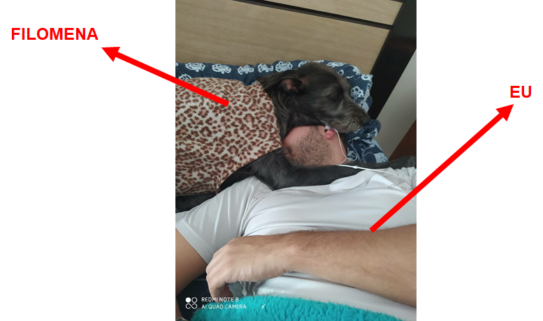

```{r xaringan-themer, include=FALSE, warning=FALSE}


library(xaringanthemer)


style_mono_light(base_color = '#23395b')


```


```{r xaringan-scribble, echo=FALSE}


xaringanExtra::use_scribble()

xaringanExtra::use_search(show_icon = TRUE)


```

class: inverse, center, middle 

## RESPEITE O PROTOCOLO DE BIOSSEGURANÇA


```{r, echo = F, fig.align = 'center', fig.alt= 'Gif para expressar que o objetivo é sério e o tema é da série the office', out.width = '50%'}


knitr::include_graphics('https://media.giphy.com/media/6R2mLi910HL4VXFwOG/giphy.gif')


```

---


## TÓPICOS ABORDADOS


[**Quem é o professor?**](#sobre_professor)


[**Qual o objetivo da disciplina?**](#objetivo_disciplina)


[**Como as aulas serão organizadas?**](#organizacao_aulas)


[**Como os atendimentos serão organizados?**](#atendimentos)


[**Qual o cronograma e quais os conteúdos da disciplina?**](#cronograma)


[**Qual o cronograma das avaliações?**](#avaliacoes)


---
class: inverse, center, middle 
name: sobre_professor


## QUEM É O PROFESSOR?


---
<div style="text-align: justify">


## PRINCIPAIS INFORMAÇÕES


- **Nome:** Victor Valerio;

- **Email:** [victor.dmv@unifei.edu.br](victor.dmv@unifei.edu.br);

- **Grupo wpp:** [_clique aqui para ingressar_](https://chat.whatsapp.com/K0ikt0cd8v8ATr28IQAYTk).


## FORMAÇÃO


- **GRADUAÇÃO**: Ciências Econômicas (UNESP);

- **MESTRADO**: Engenharia de Produção (UNIFEI)

- **DOUTORADO**: Engenharia de Produção (UNIFEI)


---
<div style="text-align: justify">


## ÁREAS DE ATUAÇÃO


- **DOCÊNCIA**: Economia (ECN001), Engenharia Econômica (EPR502), 	
Macroeconomia (ADM022), Matemática Financeira (ADM020), 
Análise 	de 	Investimento com Risco (ADM013), 
Metodologia Quantitativa em 	Administração (MPA033);


</br>


- **PESQUISA**: Análise de Eficiência e Produtividade do Mercado de 	Crédito Nacional, Análise de 
Eficiência e Produtividade de Projetos de 	Energia 	Renovável, Viabilidade Econômica de Projetos 
de Energia 	Renovável, Ciência de Dados;


</br>


- **INSTITUCIONAL**: Representante do Estado de Minas Gerais na Ordem dos Economistas do 
Brasil (OEB); Coordenador do Núcleo de Excelência em 	Sistemas Fotovoltaicos 
(NE-SFV); Pesquisador Assistente no Centro de 	Hidrogênio Verde (CHV2); 
Coordenador de Graduação em 	Administração na UNIFEI.

---
class: center, middle 

```{r, echo = F, fig.align = 'center', fig.alt= 'Gif para agradecer pela atenção e o tema é da série the office', out.width = '80%'}





```


---
class: center, middle

```{r, echo = F, fig.align = 'center', fig.alt= 'Gif para agradecer pela atenção e o tema é da série the office', out.width = '80%'}


```


---
class: inverse, center, middle 
name: objetivo_disciplina


## QUAL O OBJETIVO DA DISCIPLINA?


```{r, echo = F, fig.align = 'center', fig.alt= 'Gif para expressar que o objetivo é sério e o tema é da série the office', out.width = '50%'}


knitr::include_graphics('https://media.giphy.com/media/BpGWitbFZflfSUYuZ9/giphy.gif')


```


---
<div style="text-align: justify">


## QUAL O OBJETIVO DA DISCIPLINA?


</br>


- O objetivo geral da disciplina de Macroeconomia consiste em introduzir as principais **formulações 
teóricas** necessárias ao entendimendo do **funcionamento da economia de um país**.


</br>


- **Objetivo específico:** Sempre que possível, as **associações práticas** possíveis 
para o nível de aprofundamento alcançado serão discutidas.

---
class: inverse, center, middle
name: organizacao_aulas


## COMO AS AULAS SERÃO ORGANIZADAS?


```{r, echo = F, fig.align = 'center', fig.alt= 'Gif para expressar que o objetivo é sério e o tema é da série the office', out.width = '50%'}


knitr::include_graphics('https://media.giphy.com/media/o8LYOPJKPsYhmNgiuD/giphy.gif')


```


---
<div style="text-align: justify">


## COMO AS AULAS SERÃO ORGANIZADAS?


- As aulas serão **estritamente expositivas** e **presenciais**, uma vez que, o 
número de estudantes matriculados é inferior à capacidade máxima exigida pelo 
protocolo de biossegurança da UNIFEI;


</br>


- Assim, a dinâmica ocorrerá da seguinte maneira:

    - 10 minutos iniciais: Momento para tirar dúvidas e também para aguardar a acomodação dos estudantes;

    - Realização da “chamada”;

    - Início das exposições teóricas (início da aula).

---
<div style="text-align: justify">


## COMO AS AULAS SERÃO ORGANIZADAS?


- Em cada semana de aula será disponibilizado no SIGAA:

  - **Objetivo da aula**;

  - **Breve exposição sobre os principais conceitos trabalhados na aula**;

  - **Slide da aula (o mesmo utilizado na reunião)**;


</br>


- Inicialmente, os horários de sábado serão utilizados para realização de 
atividades de fixação. No entanto, pode ser que alguns sábados tenhamos que 
realizar algumas exposições teóricas.


---
class: inverse, center, middle
name: atendimentos


## COMO OS ATENDIMENTOS SERÃO ORGANIZADOS?


```{r, echo = F, fig.align = 'center', fig.alt= 'Gif para expressar que o objetivo é sério e o tema é da série the office', out.width = '50%'}


knitr::include_graphics('https://media.giphy.com/media/w89ak63KNl0nJl80ig/giphy.gif')


```


---
<div style="text-align: justify">


## COMO OS ATENDIMENTOS SERÃO ORGANIZADOS?


- **ATENDIMENTO EM SALA**: 

    - Como visto, no início de cada aula/semana dedicaremos um tempo para 
    discussão de potenciais dúvidas teóricas ou mesmo de exercícios.


</br>


- **ATENDIMENTO PREVIAMENTE AGENDADO**:

    - Caso o estudante queira tirar algumas dúvidas pessoalmente ele poderá 
    utilizar o seguinte link: 
    
    - [**_https://calendly.com/profvictorvalerio/atendimentos_**](https://calendly.com/profvictorvalerio/atendimentos)
    - 4 dias de antecedência;
    
    - Não precisa me pedir;
    
    - Não precisa me avisar.


---
<div style="text-align: justify">


## SOBRE A COORDENAÇÃO


- **ATENDIMENTO PREVIAMENTE AGENDADO SOBRE ASSUNTOS DA COORDENAÇÃO**:

    - Caso o estudante queira tirar algumas dúvidas pessoalmente ele poderá 
    utilizar o seguinte link: 
    
    - [**_https://calendly.com/profvictorvalerio/coordenadoradm_**](https://calendly.com/profvictorvalerio/coordenadoradm)
    - 2 dias de antecedência;
    
    - Não precisa me pedir;
    
    - Não precisa me avisar.


---
<div style="text-align: justify">


## COMO OS ATENDIMENTOS SERÃO ORGANIZADOS?

- Há ainda mais um instrumento de interação, criei um grupo no whatsapp (acho o mais dinâmico de todos). 
Por favor, ingresse no grupo! Basta clicar neste 
[**link**](https://chat.whatsapp.com/K0ikt0cd8v8ATr28IQAYTk)! Obviamente, sua entrada é facultativa!


```{r, echo = F, fig.align = 'center', fig.alt= 'Gif para expressar que o objetivo é sério e o tema é da série the office', out.width = '50%'}


knitr::include_graphics('https://media.giphy.com/media/dEdmW17JnZhiU/giphy.gif')


```

---
class: inverse, center, middle
name: cronograma


## QUAL O CRONOGRAMA E QUAIS OS CONTEÚDOS DA DISCIPLINA?

```{r, echo = F, fig.align = 'center', fig.alt= 'Gif para expressar que o objetivo é sério e o tema é da série the office', out.width = '50%'}


knitr::include_graphics('https://media.giphy.com/media/FcCLjCQ3xY7ICVtfbB/giphy.gif')


```


---
<div style="text-align: justify">


## QUAL O CRONOGRAMA E QUAIS OS CONTEÚDOS DA DISCIPLINA?


```{r , results = 'asis', echo = F, warning = F, message = F, error = F, fig.align ='center', out.width = '100%'}


library(magrittr)


library(kableExtra)


cronograma <- data.frame(
  
  AULA = c(1, 2, 3, 4, 5, 6, 7, 8),

  SEMANA = c('06/04 e 09/04','13/04 e 16/04','20/04 e 23/04','27/04 e 30/04',
             '04/05 e 07/05','11/05 e 14/05','18/05 e 21/05','25/05 e 28/05'),
  
  TEMAS = c('Apresentação da Disciplina', 
           
           'Fluxo Circular da Renda', 
           
           'Agregados Macroeconômicos', 
           
           'Nível de Atividade',
           
           'Mercado de Trabalho',
           
           'Taxa de Inflação',
           
           'Consolidação dos Temas', 
           
           'PROVA 1 (Aulas 2 à 7)'))


knitr::kable(cronograma, 
             
             escape = FALSE,
    
             format = 'html',
             
             align = c('c', 'c', 'c')) %>%
  
  kable_styling(bootstrap_options = 'striped')
  


```


---
<div style="text-align: justify">


## QUAL O CRONOGRAMA E QUAIS OS CONTEÚDOS DA DISCIPLINA?


```{r , results = 'asis', echo = F, warning = F, message = F, error = F, fig.align ='center', out.width = '100%'}


library(magrittr)


library(kableExtra)


cronograma <- data.frame(
  
  AULA = c(9, 10, 11, 12, 13, 14, 15, 16),
  
  SEMANA = c('01/06 e 04/06','08/06 e 11/06','15/06 e 08/06','22/06 e 25/06',
             '29/06 e 01/07','06/07 e 09/07','13/07 e 16/07','20/07 e 23/07'),
  
  CONTEÚDO = c('Taxa de Juros',
           
           'Mercado de Crédito', 
           
           'Taxa de Câmbio', 
           
           'Política Fiscal', 
           
           'Política Monetária', 
           
           'Consolidação dos Temas',
           
           'PROVA 2 (Aulas 9 à 15)', 
           
           'PROVA SUB (Todas as aulas)'))


knitr::kable(cronograma, 
             
             escape = FALSE,
    
             format = 'html',
             
             align = c('c', 'c', 'c')) %>%
  
  kable_styling(bootstrap_options = 'striped')
  


```


---
class: inverse, center, middle
name: avaliacoes


## QUAL O CRONOGRAMA DAS AVALIAÇÕES?


```{r, echo = F, fig.align = 'center', fig.alt= 'Gif para expressar que o objetivo é sério e o tema é da série the office', out.width = '50%'}


knitr::include_graphics('https://media.giphy.com/media/FcCLjCQ3xY7ICVtfbB/giphy.gif')


```


---
<div style="text-align: justify">


## QUAL O CRONOGRAMA DAS AVALIAÇÕES?


```{r , results = 'asis', echo = F, warning = F, message = F, error = F, fig.align ='center', out.width = '100%'}


library(magrittr)


library(kableExtra)


cronograma <- data.frame(
  
  
  CONTEÚDOS = c('Aulas 2 à 7', 'Aulas 9 à 15', 'Todas as aulas teóricas'),
  
  REFERÊNCIA = c('Prova 1', 'Prova 2', 'Prova Substitutiva')
)
  


knitr::kable(cronograma, 
             
             escape = FALSE,
    
             format = 'html',
             
             align = c('l', 'c', 'c')) %>%
  
  kable_styling(bootstrap_options = 'striped')
  


```


---
<div style="text-align: justify">


## QUAL A COMPOSIÇÃO DAS NOTAS?


</br>


- Equação Nota 1: $Nota_1  = 0,8 Prova_{parte 1} + 0,2 Questionários_{parte 1}$


</br>


- Equação Nota 2: $Nota_2  = 0,8 Prova_{parte 2} + 0,2 Questionários_{parte 2}$


</br>


- Equação Nota Final: $Nota_{Final}  = (Nota_1 + Nota_2)/2$


---
class: inverse, center, middle


```{r, echo = F, fig.align = 'center', fig.alt= 'Gif para agradecer pela atenção e o tema é da série the office', out.width = '80%'}


knitr::include_graphics('https://media.giphy.com/media/n4oKYFlAcv2AU/giphy.gif')


```

